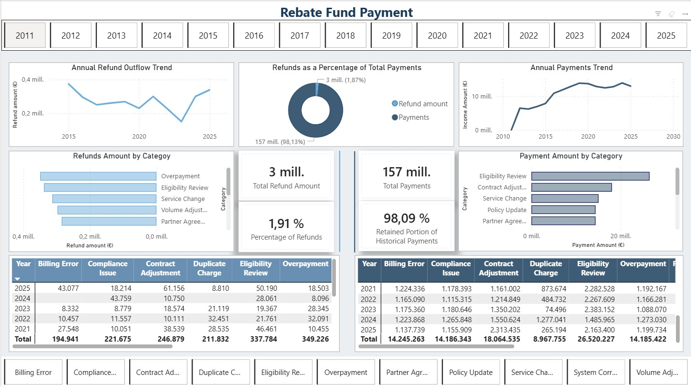

# Aileen's Data Portfolio

Welcome to my professional data portfolio. This repository showcases projects in **Power BI** and **R Studio**, demonstrating data analysis, visualization, and problem-solving skills. All data used is generic, fictional or anonymized for portfolio purposes.

## Projects

### 1. Power BI Dashboard Mockup
**Context:** Generic refunds data dashboard created as a portfolio mockup.  
**Objective:** Demonstrate dashboard design, data visualization, and Power BI skills.  
**Tools Used:** Power BI, Excel, DAX  
**Screenshots:**  
  
**Insights:** The dashboard highlights payments and refunds trends, top refund's causes, and percentaje of refund by payments.

